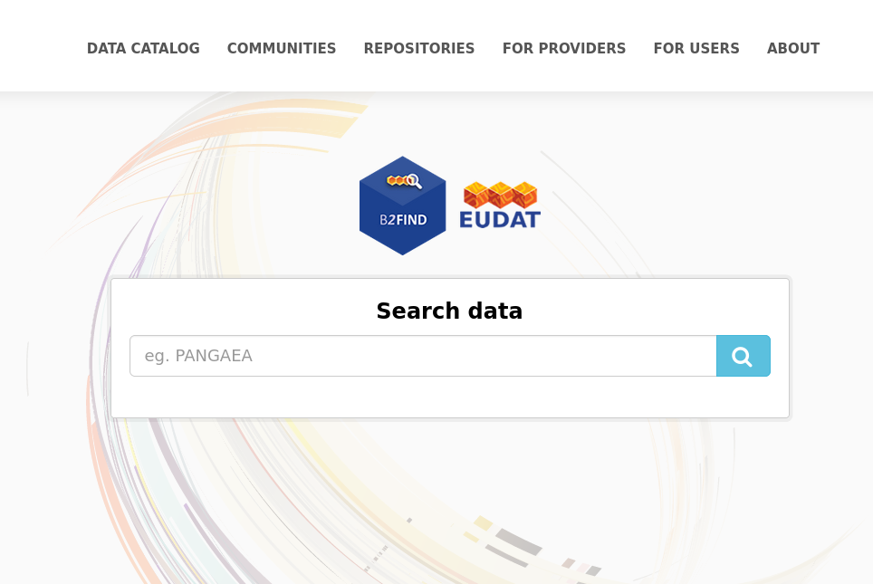
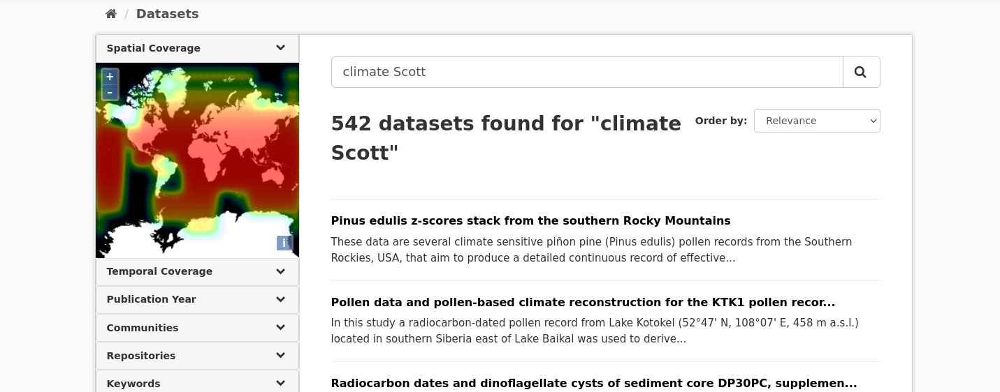
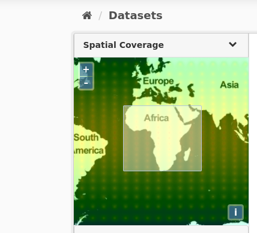
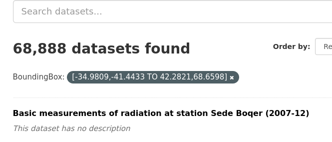
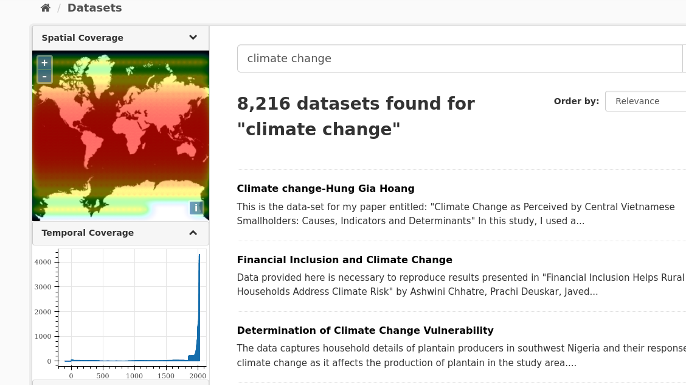

# For Users

## Search Guide

### The B2FIND Portal
You can access the EUDAT metadata discovery portal B2FIND at b2find.eudat.eu. It can be utilized in two ways:

* The discovery web portal supports user-friendly navigation and filtering features. Powerful search functionalities are provided, that include:
	* Free text search over the full text bodies of all datasets indexed in the B2FIND catalogue
	* Geospatial and temporal search for all datasets, that cover a chosen region or, respectively, a chosen time period.
	* Other faceted search, i.e. selecting values from certain metadata fields

In the following we describe the usage of B2FIND step by step.

### Welcome
The B2FIND homepage is your starting point.

Clicking on 'Data Catalogue' will lead you directly to the metadata catalogue with its faceted search options. By clicking 'Communities' you get an overview about all communities that provide metadata to B2FIND. 
The 'Repositories' tab shows you a list of all underlying repositories that B2FIND harvest from. One community can comprise several repositories, like GFZ Data Services for example. The 'For Providers' and 'For Users' tabs lead to targeted information for either metadata providers or searchers. And in the 'About' section you find the official EUDAT service description as well as ways to contact the B2FIND team.

### Free Text Search
There are two ways to start the search process and to get taken to the search result page with all available datasets listed on the right side and the different filter options or 'facets' on the left:

1. By clicking 'Data Catalogue' and then using the free text search field on top of the page.
2. By pressing the magnifying glass in the free text field of the homepage. Here you can already enter a search query.

Either way, simply type in your search terms and hit return. The Solr search engine will then search in all metadata fields for your search terms. For example, if you are interested in documents or datasets on 'climate' and you know that somebody with the name 'Scott' did something with it you would type "climate Scott" and get this result:

### Faceted Search
The faceted search interface provides you with options to filter your search by choosing 'facets'. This tool may help you to narrow down the search results for your specific search demands.

B2FIND provides the opportunity to filter out datasets that have a given extent in space or in time. This is implemented by the following three graphical interfaces :

* 'Filter by location' searches for all datasets which have an intersection with a region chosen from the world map.
* 'Filter by time' searches for all datasets which cover a chosen time period.
* 'Publication Year' searches for all datasets which have been published (or will be made publicly available) within a given period of years.

Furthermore, you can filter by all facets provided by the [EUDAT Core metadata schema]('https://eudat-b2find.github.io/schema-doc/introduction.html') which B2FIND uses.

#### Filter by location

In the world map widget in the left upper corner you can select a geographical region your search query is about. This triggers a search for all datasets whose spatial extension has an intersection with the selected region.

For Windows: Hold STRG+left mouse button pressed and move over the map to create a bounding box over the region you are interested in. Releasing STRG+mouse button then triggers a search request (give it up to 5 seconds please), the results will appear on the right result page.
For Mac Os: hold Command+left mouse button.

If you draw a bounding box over Africa, for example, all datasets whose spatial extension has an overlap with the selected region are listed in the right panel.The dataset search result page will then look like this:

Note the dark grey tag announcing the filter in use. To delete the filter, just click on the 'x' on its right.

#### Temporal Coverage
With the search widget 'Temporal Coverage' you can select a time period the research data are related to as described in the following.

1. Expanding the facet 'Temporal Coverage' in the navigation panel opens the time line chart. Here you can already see, what time period most datasets (for example combined with the keyword search 'climate change') deal with. The temporal coverage depicted here strictly refers to the temporal period the datasets are about, **not** the publication year (that will be covered by the next facet).

2. To select a certain time period, draw a box over the period in question by mouse-over while keeping the left mouse button pressed. Releasing your mouse will trigger the search and the result page 
will change accordingly (again, give it 5 seconds please).

3. Repeat as you wish for zooming in further. The search results on the right will narrow down accordingly.
To delete the temporal coverage filter, press on the 'x' on the filter button above the result page. 

#### Filter by Publication Year
With the search widget 'Publication Year' you can search for datasets that have been published (or in case of an embargo period: will be made publicly available) within a certain period of time. This gives a nice overview on when a lot of datasets catalogued in B2FIND were published on your search topic, i.e.psychoanalysis.

This facet works exactly like the 'Temporal Coverage' one above: 
1. Drag your mouse over the selected publication time period while holding the left mouse button pressed. 
2. Release to trigger search.
3. Repeat to zoom in more.
4. If execution of the query is finished, all datasets that are published within the chosen years are listed in the right panel. To delete the filder, press the 'x' on the dark grey filter tag above the search results.

### Metadata Display

By clicking the dataset title the dataset view opens. The textual metadata are shown on the right side; on top the title, the description and the keywords as clickable buttons and underneath the other B2FIND metadata fields with their values in tabulated form. If the dataset contains spatial information, the spatial extent of the dataset is shown on the map in the upper left corner. 

### Data Access
Among these fields are links provided that enable access on related data.

* The data resources the metadata are related to.
* The original metadata - as harvested from the provider by OAI-PMH and formatted in XML.

### Metadata as Harvested
If you want to examine the 'raw' metadata as originally harvested by B2FIND from the data provider you can click on the field 'MetadataAccess' and the associated XML record is listed in the browser.
