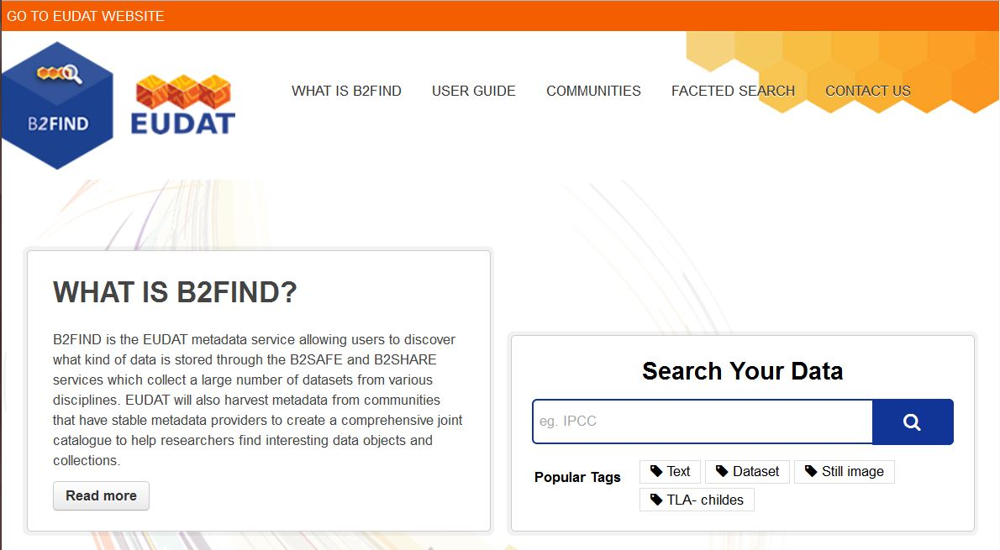

# For Users

## Search Guide

### Introduction
The EUDAT metadata service B2FIND can be utilized in two ways:

* The discovery web portal supports user-friendly navigation and filtering features. Powerful search functionalities are provided, that include:
	* Free text search over the full text bodies of all datasets indexed in the B2FIND catalog
	* Geospatial and temporal search for all datasets, that cover a chosen region or, respectively, a chosen time period.
	* Other 'faceted' search, i.e. selecting values from certain metadata fields
* The script searchB2FIND.py enables submitting search requests from the command line using the CKAN API functionality

The according search requests can be combined and executed in one go. A successful search results in the list of all datasets of the B2FIND catalogue, which fulfill the search criteria. The metadata fields of each found dataset can be displayed and comprises as well links to access the underlying data objects. In the following we describe the usage of B2FIND step by step.

### The B2FIND Portal
You can access the B2FIND web portal at b2find.eudat.eu. The only prerequisite - beside access to the internet - to use the web interface is, that JavaScript is enabled in the used web browser.

By clicking 'Communities' you get an overview about all communities that provide metadata to B2FIND.
There are two ways to start the search process and to get taken to the search result page (fig. 2), with all available datasets listed on the right side and the interface to several search and filter functionalities in the navigation bar on the left side:

1. By clicking 'Faceted Search'
2. By pressing the magnifying glass in the free text field 'Search your data'. (At this stage you can already enter a string to be searched for or choose one of the shown 'Popular Tags').

####Free Text Search
#####Full Text Search
#####Key-Value Search
#####Combined Search
####Faceted Search Interface
#####Filter by Location
#####Filter by Time
#####Filter by Publication Year
#####Filter and Sort Textual Facets
####Search Results
#####Metadata Display
#####Data Access
#####Resource Data
#####Metadata as Harvested
####Command Line Interface
####Use Case Scenario

## Training Materials
links training materials if they exist

